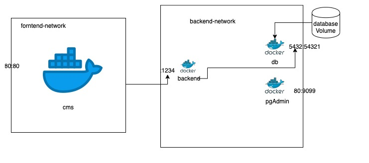

# DevOps for CMS

## Design




## Codebase

* [https://github.com/guzhongren/CMS-backend](https://github.com/guzhongren/CMS-backend)
* [https://github.com/guzhongren/CMS-backend](https://github.com/guzhongren/CMS-backend)

## Start

```shell
docker-compose up
```

## Browser

[http://127.0.0.1:8091](http://127.0.0.1:8091)

## Login

admin#000000
